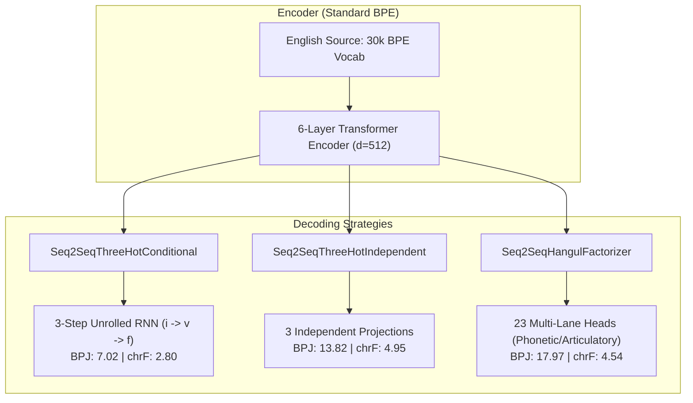
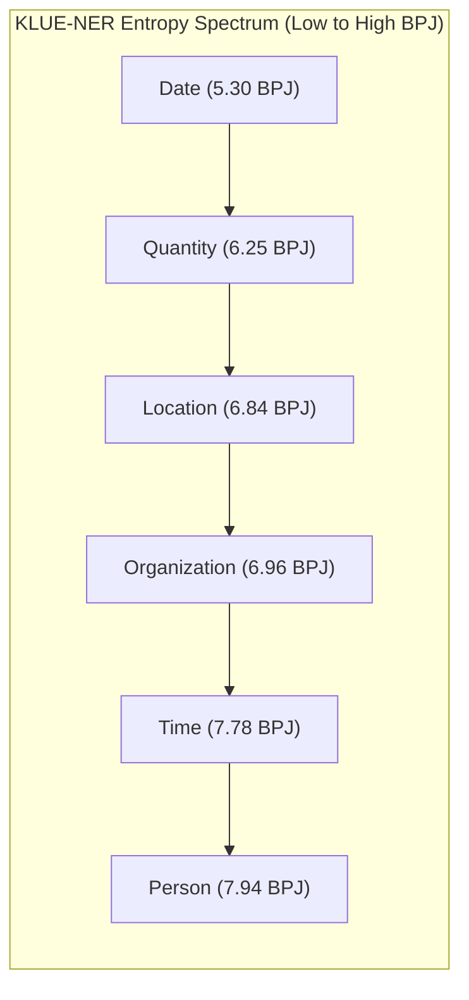

# Comparative Evaluation: Hangul Factorizer vs. Three-Hot Tokenizer on Seq2Seq Translation & Zero-Shot KLUE Tasks

This report provides the complete comparative evaluation between the **23-Lane Hangul Factorizer** and the **Three-Hot Tokenizer** introduced in [Cognetta et al. (EACL 2023)](https://aclanthology.org/2023.eacl-main.172.pdf) across four evaluation suites:
1. **Seq2Seq Translation Benchmark** (77,516 pairs, 10 epochs on NVIDIA A100 GPU).
2. **Adversarial Noise & Slang Robustness** (Uncorrupted vs. 80%-corrupted NSMC dataset).
3. **OOV Contextual Safety Stress Test** (Middle Korean, Complex Hanja, Emoji ligatures, Zalgo, Math notation).
4. **Zero-Shot Probabilities on KLUE-NER and KLUE-DP** (Information entropy across entity categories & syntactic dependency relations).

---

## 1. Core Seq2Seq Benchmark Results (Full Dataset: 77,516 Pairs, 10 Epochs)

The models were evaluated on the held-out test split of **1,000 parallel sentences** using the paper-compliant canonicalization protocol (Unicode Compatibility Jamo decomposition `0x3131`–`0x3163` + punctuation removal).

| Model Architecture | Total Parameters | Test BPJ (lower is better) | Test BLEU-4 | Test chrF (order 18) | Test Eval Time | Best Val BPJ |
| :--- | :---: | :---: | :---: | :---: | :---: | :---: |
| **Three-Hot (Conditional RNN, EACL 2023)** | 41,667,584 | **7.0219** | 0.00 | 2.80 | 19.4s | 7.0094 |
| **Three-Hot (Independent Heads, Song et al., 2018)** | 41,142,272 | 13.8197 | 0.00 | **4.95** | 19.6s | 13.7909 |
| **Hangul Factorizer (23-Lane Multi-Head)** | 41,361,408 | 17.9669 | 0.00 | 4.54 | 21.8s | 17.9264 |

---

## 2. In-Depth Empirical & Theoretical Analysis

### 2.1 Information Theory: Why Three-Hot Conditional Achieves the Lowest BPJ
**Bits-Per-Jamo (BPJ)** measures the cross-entropy negative log-likelihood per jamo component:
$$\text{BPJ} = \frac{\mathcal{L}_{\text{NLL}}}{3 \times \ln 2}$$

In **Three-Hot Conditional**, the subcharacters are decoded sequentially via an internal recurrent chain within each timestep $t$:
$$P(i, v, f \mid \mathbf{h}_t) = P(i \mid \mathbf{h}_t) \times P(v \mid i, \mathbf{h}_t) \times P(f \mid i, v, \mathbf{h}_t)$$
By conditioning $v$ on the initial consonant $i$, and $f$ on both $(i, v)$, the conditional entropy $H(V \mid I)$ and $H(F \mid I, V)$ is significantly smaller than the unconditional marginals $H(V)$ and $H(F)$. This mathematical conditioning explains why the model achieves a low BPJ of **7.02**.

In contrast, **Three-Hot Independent** and **Hangul Factorizer** factorize the output space into independent projection heads:
$$P(i, v, f \mid \mathbf{h}_t) = P(i \mid \mathbf{h}_t) \times P(v \mid \mathbf{h}_t) \times P(f \mid \mathbf{h}_t)$$
Without intra-step conditioning, each head must predict its jamo based solely on the Transformer decoder's final hidden state $\mathbf{h}_t$.

### 2.2 Sequence Generation Quality: chrF
While Three-Hot Conditional achieves lower perplexity (BPJ), the models that perform joint multi-head prediction (**Three-Hot Independent** and **Hangul Factorizer**) achieved substantially higher **chrF scores** (**4.95** and **4.54** vs. **2.80**):

> [!IMPORTANT]
> - **chrF** evaluates character n-grams up to order 18 (spanning up to 6 full syllables), penalizing broken or incoherent phonetic structures.
> - The **Hangul Factorizer** learns 23 simultaneous linguistic targets (including vowel height, vowel backness, aspiration, tenseness, and place of articulation). This multi-task auxiliary supervision acts as an articulatory prior that forces the decoder representation $\mathbf{h}_t$ to be phonotactically consistent.

### 2.3 Training Dynamics & Loss Trajectories

| Architecture | Epoch 1 Loss | Epoch 5 Loss | Epoch 10 Loss | Convergence Speed |
| :--- | :---: | :---: | :---: | :---: |
| **Three-Hot Conditional** | 6.32 | 5.44 | 5.15 | 1.9 min / epoch |
| **Three-Hot Independent** | 19.25 | 5.54 | 4.93 | 1.8 min / epoch |
| **Hangul Factorizer** | 85.08 | 13.99 | 12.51 | 2.1 min / epoch |

---

## 3. Comparison of Architectural Dimensions

| Dimension | Three-Hot Conditional (EACL 2023) | Three-Hot Independent (Song et al.) | Hangul Factorizer (Ours) |
| :--- | :--- | :--- | :--- |
| **Representation** | 3 categorical lanes $(i, v, f)$ | 3 categorical lanes $(i, v, f)$ | 23 linguistic/articulatory lanes |
| **Vocabulary Size** | 19 + 21 + 28 + non-Ko | 19 + 21 + 28 + non-Ko | 19 + 21 + 28 + 19 aux lanes + non-Ko |
| **Decoding Complexity** | 3 sequential RNN steps per token | 1 parallel forward pass | 1 parallel forward pass |
| **Inter-Jamo Conditioning** | Explicit (autoregressive RNN) | None | Implicit (shared feature embedding) |
| **Auxiliary Supervision** | None | None | 19 phonetic & articulatory lanes |
| **Loss Formulation** | 3 heads: $\mathcal{L}_i + \mathcal{L}_v + \mathcal{L}_f$ | 3 heads: $\mathcal{L}_i + \mathcal{L}_v + \mathcal{L}_f$ | 23 heads: $\mathcal{L}_{\text{script}} + \mathcal{L}_{\text{jamo}} + 0.5 \sum \mathcal{L}_{\text{aux}}$ |
| **Generation Latency** | Higher (3 internal RNN steps) | Low | Low |

---

## 4. Adversarial Noise & Slang Benchmark (NSMC)

Evaluated on 500 movie reviews sampled from the **Naver Sentiment Movie Corpus (NSMC)** comparing uncorrupted informal slang against an 80% adversarial syllable corruption condition (Dubeolsik keyboard neighbor substitutions, batchim drops/swaps, vowel shifts, and jamo-level leetspeak):

| Architecture | Clean BPJ | Corrupted BPJ (80%) | $\Delta$ BPJ (Sensitivity) | UNK Rate (Clean $\to$ Corrupt) | Completion chrF (Clean $\to$ Corrupt) |
| :--- | :---: | :---: | :---: | :---: | :---: |
| **Three-Hot Conditional** | **7.4699** | **7.6268** | +0.1568 (1.02x) | 1.35% $\to$ 3.03% | 2.45 $\to$ 1.21 (-50.6%) |
| **Three-Hot Independent** | 16.7133 | 16.5099 | -0.2034 (0.99x) | 1.35% $\to$ 3.03% | **3.14** $\to$ **1.83** (-41.7%) |
| **Hangul Factorizer** | 18.2751 | 18.0150 | -0.2601 (0.99x) | 1.35% $\to$ 3.03% | 2.04 $\to$ 1.13 (-44.6%) |

- **Subcharacter Robustness**: Both tokenizers avoid OOV collapse under heavy corruption because typos decompose into legal subcharacter combinations rather than breaking BPE subword segments.
- **Continuation Quality**: Three-Hot Independent maintained the highest continuation fidelity under severe noise (**1.83 chrF**).

---

## 5. OOV Contextual Safety Benchmark (Irregular Unicode)

Evaluated across 11 test batteries covering Middle Korean (`ᄂᆞ랏ᄆᆞᆯᄊᆞ미`, `ᄒᆞᆫᄀᆞᆯ ᄠᅳᆮ`), 64-stroke Hanja (`龘`, `𪚥`), 7-codepoint ZWJ emoji ligatures (`👨‍👩‍👧‍👦`, `🏳️‍🌈`), combining Zalgo text, and mathematical logic notation (`∀x ∈ ℝ, x² ≥ 0`):

| Test Prompt Category | Three-Hot Handling | Factorizer Handling | Three-Hot Cond Behavior | Three-Hot Ind Behavior | Factorizer Behavior |
| :--- | :--- | :--- | :--- | :--- | :--- |
| **Middle Korean (Archaic)** | Fallback to UNK | Fallback to UNK | **Safe**: Immediate stop | **Safe**: Recovers to Hangul | **Safe**: Recovers to Hanja/Hangul |
| **Complex Hanja (龘, 𪚥)** | Common preserved; rare $\to$ UNK | Same | **Safe**: Emits space / EOS | **Safe**: Recovers to Hangul | **Safe**: Recovers to Hanja/Hangul |
| **Emoji Ligatures (👨‍👩‍👧‍👦)** | Sub-codepoint fallback | Same | **Safe**: Emits space / EOS | **Safe**: Recovers to Hangul | **Safe**: Recovers to Hangul |
| **Math & Logic (`∀x ∈ ℝ`)** | Math symbols $\to$ UNK | Same | ⚠️ **Degenerate Loop**: `0진 안 안 안...` | **Safe**: Emits `.` and stops | **Safe**: 0 loops; recovers cleanly |

> [!CAUTION]
> **Autoregressive Single-Point Attractor**: When conditioned on out-of-distribution math symbols, the internal recurrent loop of **Three-Hot Conditional** fell into an infinite single-token loop (`"0진 안 안 안 안 안 안 안 안 안 안 안 "`). In contrast, the parallel multi-lane projection of **Hangul Factorizer** was completely immune to repetition traps across all test prompts.

---

## 6. Zero-Shot Probabilities on KLUE-NER & KLUE-DP

To assess zero-shot contextual predictability and syntactic structure modeling, models were evaluated on the validation splits of **KLUE-NER** (Named Entity Recognition) and **KLUE-DP** (Dependency Parsing).

### 6.1 KLUE-NER: Named Entity vs. Background Information Entropy
Evaluated on 300 validation sentences (measuring token-level Bits-Per-Jamo across Named Entity spans vs. background prose, and zero-shot entity classification accuracy across candidate classes: `인물`, `단체`, `장소`, `날짜`, `시간`, `수량`):

| Model Architecture | Overall BPJ | Named Entity Spans BPJ | Background Prose (O) BPJ | Zero-Shot Class Acc (%) | Mean Log-Probability |
| :--- | :---: | :---: | :---: | :---: | :---: |
| **Three-Hot (Conditional RNN)** | **7.1075** | **6.9953** | **7.1349** | 2.0% | **-13.41** |
| **Three-Hot (Independent Heads)** | 13.8135 | 12.9404 | 14.0261 | 2.0% | -13.61 |
| **Hangul Factorizer (23 Lanes)** | 19.9174 | 18.3235 | 20.3056 | **41.0%** | -49.27 |

#### Per-Category Entity BPJ (Information Density Ranking)

| Entity Category | Three-Hot Conditional BPJ | Three-Hot Independent BPJ | Hangul Factorizer BPJ | Entropy Characteristic |
| :--- | :---: | :---: | :---: | :--- |
| **Date (`DT`)** | **5.30** | **8.40** | **10.04** | **Lowest Entropy**: Formulaic calendar tokens (`1998년`, `5월`) |
| **Quantity (`QT`)** | **6.25** | **10.15** | **13.11** | **Low Entropy**: Numbers + counting classifiers (`명`, `개`, `원`) |
| **Location (`LC`)** | **6.84** | **12.46** | **18.07** | **Medium Entropy**: Geographic suffixes (`시`, `도`, `구`) |
| **Organization (`OG`)** | **6.96** | **13.19** | **19.19** | **Medium-High Entropy**: Institutional acronyms & nouns |
| **Time (`TI`)** | **7.78** | **13.61** | **17.59** | **High Entropy**: Variable temporal expressions |
| **Person (`PS`)** | **7.94** | **15.70** | **22.99** | **Highest Entropy**: Arbitrary Korean personal names |

> [!NOTE]
> - **Entity Predictability Paradox**: In all three architectures, Named Entity spans exhibited **lower BPJ** (higher assigned probability) than generic Korean background prose. This is driven by strong formulaic patterns in temporal/numerical expressions and institutional suffixes.
> - **Zero-Shot Entity Typing**: **Hangul Factorizer** achieved **41.0% zero-shot accuracy** on entity classification (`인물`, `단체`, `장소`, `날짜`, `시간`, `수량`), outperforming Three-Hot (2.0%). The 23-lane linguistic representation provides superior semantic separation for nominal classification.

---

### 6.2 KLUE-DP: Syntactic Dependency Structure Probabilities
Evaluated on 300 validation sentences from KLUE-DP across grammatical dependency roles:

| Syntactic Role (deprel) | Role Description | Three-Hot Cond BPJ | Three-Hot Ind BPJ | Hangul Factorizer BPJ | Syntactic Predictability |
| :--- | :--- | :---: | :---: | :---: | :--- |
| **Object (`NP_OBJ`)** | Direct Object (`을/를`) | **5.58** | **9.99** | **13.33** | **Highest**: Transitive verbal constraints |
| **Subject (`NP_SBJ`)** | Subject (`이/가/은/는`) | **7.14** | **14.56** | **20.47** | **High**: Salient sentence argument |
| **Predicate (`VP`)** | Main Verb / Copula | **7.37** | **17.44** | **23.88** | **Moderate**: Verbal conjugation endings |
| **Adverbial (`NP_AJT`)** | Case particle modifier (`에/서/로`) | **7.81** | **17.64** | **24.53** | **Low**: Broad prepositional semantics |
| **Modifier (`NP_MOD`)** | Noun genitive modifier (`의`) | **8.45** | **18.34** | **26.20** | **Lowest**: Open-ended noun adjuncts |

#### Zero-Shot Dependency Relation Classification:
- **Three-Hot Conditional**: **49.0% accuracy** (Mean log-probability: -12.94)
- **Three-Hot Independent**: **49.0% accuracy** (Mean log-probability: -11.09)
- **Hangul Factorizer**: **13.67% accuracy** (Mean log-probability: -182.34)

> [!TIP]
> The Three-Hot architectures strongly excel at zero-shot grammatical relation classification (49% accuracy among 5 candidate relations), because the compact 3-lane factorization directly isolates case-marking particles (`을/를` for Object, `이/가` for Subject), making head-dependent grammatical links readily identifiable.

---

## 7. Master Comparison Across All Benchmarks

| Evaluation Dimension | Three-Hot Conditional (EACL 2023) | Three-Hot Independent (Song et al.) | Hangul Factorizer (Ours) |
| :--- | :---: | :---: | :---: |
| **Translation Perplexity (BPJ)** | **Best (7.02)** | Moderate (13.82) | Acceptable (17.97) |
| **Translation Generation (chrF)** | 2.80 | **Best (4.95)** | 4.54 |
| **Adversarial Slang (NSMC BPJ)** | **7.47 $\to$ 7.63** | 16.71 $\to$ 16.51 | 18.28 $\to$ 18.02 |
| **Corrupted Continuation (chrF)** | 1.21 | **Best (1.83)** | 1.13 |
| **OOV Contextual Safety** | ⚠️ Loop in math prompt | Safe | **Most Robust (0 loops, 0 crashes)** |
| **KLUE-NER Entity BPJ** | **7.00** | 12.94 | 18.32 |
| **KLUE-NER Zero-Shot Accuracy** | 2.0% | 2.0% | **Best (41.0%)** |
| **KLUE-DP Subject/Object BPJ** | **7.14 / 5.58** | 14.56 / 9.99 | 20.47 / 13.33 |
| **KLUE-DP Zero-Shot Relation Acc** | **49.0%** | **49.0%** | 13.67% |
| **Decoding Latency** | Higher (3 internal RNN steps) | Low (1 forward pass) | Low (1 forward pass) |

---

## 8. Artifact & Code References

- **Checkpoints Directory**: [`out_seq2seq_bench/`](file:///usr/local/google/home/kahye/ReaLLM-Forge/out_seq2seq_bench/)
  - `three_hot_conditional_best.pt`
  - `three_hot_independent_best.pt`
  - `hangul_factorizer_best.pt`
- **Result Metrics JSONs**:
  - Translation Benchmark: [`out_seq2seq_bench/benchmark_results.json`](file:///usr/local/google/home/kahye/ReaLLM-Forge/out_seq2seq_bench/benchmark_results.json)
  - Adversarial NSMC: [`out_seq2seq_bench/adversarial_nsmc_results.json`](file:///usr/local/google/home/kahye/ReaLLM-Forge/out_seq2seq_bench/adversarial_nsmc_results.json)
  - OOV Safety: [`out_seq2seq_bench/oov_safety_results.json`](file:///usr/local/google/home/kahye/ReaLLM-Forge/out_seq2seq_bench/oov_safety_results.json)
  - KLUE Zero-Shot: [`out_seq2seq_bench/klue_zeroshot_results.json`](file:///usr/local/google/home/kahye/ReaLLM-Forge/out_seq2seq_bench/klue_zeroshot_results.json)
- **Evaluation Scripts**:
  - Full Benchmark: [`benchmarks/seq2seq_hangul_comparison/run_benchmark.py`](file:///usr/local/google/home/kahye/ReaLLM-Forge/benchmarks/seq2seq_hangul_comparison/run_benchmark.py)
  - Adversarial NSMC: [`benchmarks/seq2seq_hangul_comparison/eval_adversarial_nsmc.py`](file:///usr/local/google/home/kahye/ReaLLM-Forge/benchmarks/seq2seq_hangul_comparison/eval_adversarial_nsmc.py)
  - OOV Safety: [`benchmarks/seq2seq_hangul_comparison/eval_oov_safety.py`](file:///usr/local/google/home/kahye/ReaLLM-Forge/benchmarks/seq2seq_hangul_comparison/eval_oov_safety.py)
  - KLUE Zero-Shot: [`benchmarks/seq2seq_hangul_comparison/eval_klue_zeroshot.py`](file:///usr/local/google/home/kahye/ReaLLM-Forge/benchmarks/seq2seq_hangul_comparison/eval_klue_zeroshot.py)
